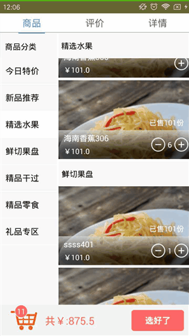

# orderDishes

 欢迎大家进群：574605026   开启我们的开发之旅

先看图：

1、布局，左右分别是listview，我用left和right标识
2、事件，左边listview点击事件(onitemonclick)改变右边的listview的滚动位置，其次右边listview滚动事件(onscrollListener)改变左边listview的位置。
3、右边title的变化，点击左边listview改变，右边滚动到type的时候改变
4、点击加减号的抛物线动画  可以参考我的博客http://blog.csdn.net/mingzhnglei/article/details/54342644
5、购物车的时间，popuview。
6、数据在这里我是用的数据库存储

http://blog.csdn.net/mingzhnglei/article/details/54133673这篇博客里大家可以看下，增加下了解
